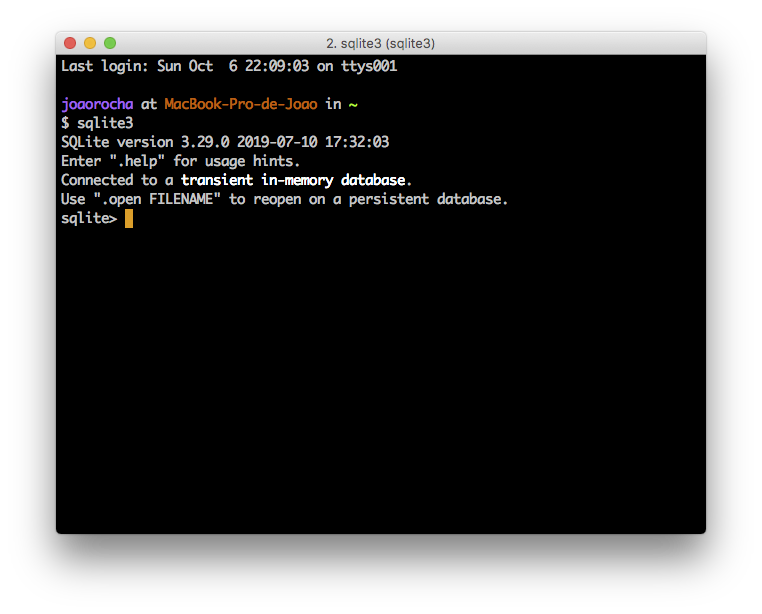
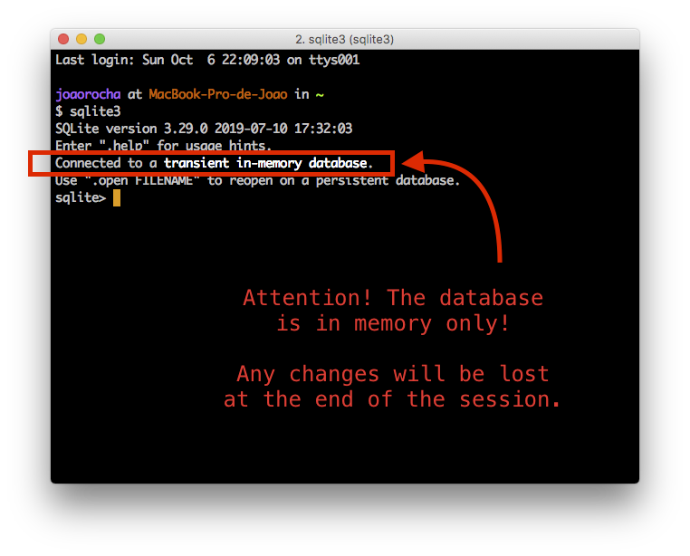
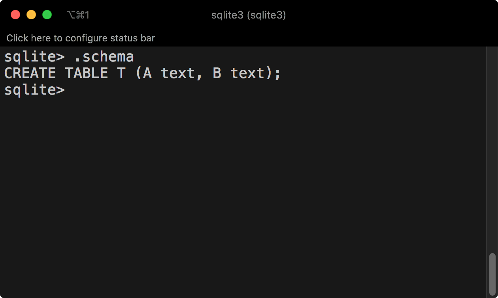
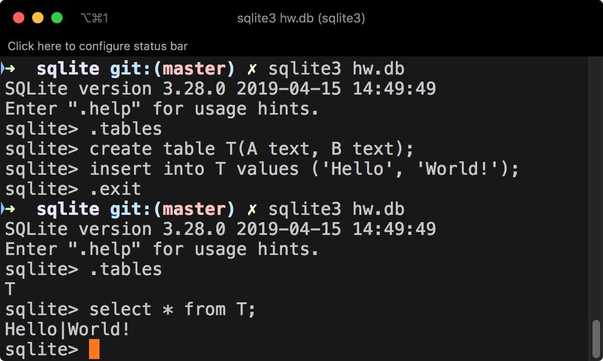
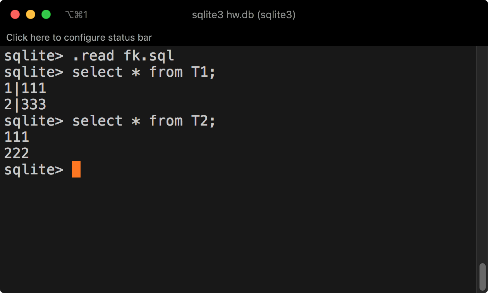
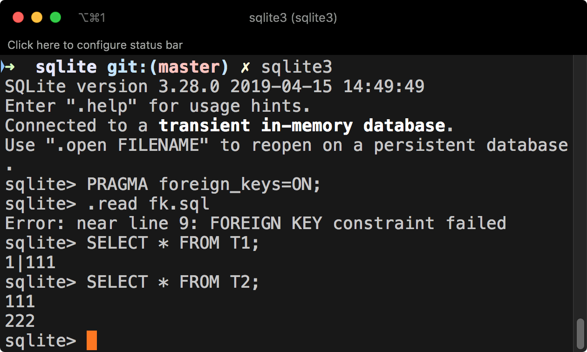

## About 

SQLite is a lightweight Database Management System (DBMS) which allows its users to implement a relational schema and run SQL queries over it, without the need for a standalone database server. This is convenient because the setup is minimal and the database can be easily bundled with application files.

SQlite is portable, which means that you can install it on any computer, even when you do not have Administration privileges. It is also quite interesting for mobile development in platforms such as Android or iOS.

SQLite implements ACID (Atomic, Consistent, Isolated, and Durable) transactions. This makes it possible to rollback all changes made during transactions in the event of a system crash or power loss.

SQLite does not, however, implement the [SQL Standard](https://en.wikipedia.org/wiki/SQL#Interoperability_and_standardization). 

For our classes we will be using [SQLite3](https://www.sqlite.org/download.html). 

## Installing SQLite3

All FEUP computers have sqlite3 already installed, so you should not need to carry out this step in those machines. If you want to install it in your personal laptop for home work or study, read on.

### Manual Installation (portable)

1. Download the precompiled binaries for `sqlite-tools` from the [website](https://www.sqlite.org/download.html) and unzip them to a folder in your computer. Please choose the appropriate file depending on your operating system (Windows, Linux or macOS).
   - For Windows, I recommend you unzip the download into `C:\sqlite3`. For other OS's you should use your home folder, like `~/sqlite3`.
2. Navigate to the folder where you extracted your download
3. You should see 3 files:


### Automatic installation 

#### macOS 

1. Install [HomeBrew](https://brew.sh)
2. Open Terminal  
3. Type `brew install sqlite3` and press Enter.

#### Linux (debian-based distros such as Ubuntu and derivatives)

1. Open Terminal emulator
2. Type `sudo apt-get update && sudo apt-get install sqlite3` and press Enter.


## Installing the Graphical User Interface

We will also be using a GUI (Graphical User Interface) to manipulate our SQLite databases. [SQLiteStudio](https://sqlitestudio.pl/index.rvt) is free and runs on every Operating System. Detailed installation instructions for Windows, Mac and Linux are available [here](https://sqlitestudio.pl/index.rvt?act=download).


### MacOS 
For macOS you can use [homebrew](https://brew.sh). Just run the following command: `brew cask install sqlitestudio`.

### Linux 

For Linux, unzip the installer in the [downloads page](https://sqlitestudio.pl/index.rvt?act=download). Open the Terminal, `cd` to the Downloads folder and make the installer executable by running the command `chmod +x ./InstallSQLiteStudio-3.2.1`. Then run it: `./InstallSQLiteStudio-3.2.1`. The installer should start up.

## Starting SQLite

### In a FEUP machine

1. Press the `Windows Key + R`. A small window will pop up. 
2. Type `cmd.exe` and press Enter.
3. A command line window will pop up.
4. Type sqlite3 and press Enter.
5. You will now be in the SQLite3 command line.



### In your own computer

To create a database you must first navigate to the folder where sqlite3 is installed. Assuming that you unzipped the downloaded files to `C:\sqlite` as previously explained, do this:

1. Press the `Windows Key + R`. A small window will pop up. 
2. Type `cmd.exe` and press Enter.
3. A command line window will pop up.
4. Type `C:`
5. Type `cd C:\sqlite3`
6. Type `sqlite3.exe` and press Enter.
7. You will now be in the SQLite3 command line.

## Useful commands

| Command           | Description                                                  |
| ----------------- | ------------------------------------------------------------ |
| **.databases**    | List names and files of attached databases                   |
| **.dump**         | Dump the database or a specific table in an SQL text format  |
| **.exit / .quit** | Exit the SQLite shell                                        |
| **.headers**      | Turn display of headers on or off, when displaying output of SQL<br/>statements |
| **.help**         | Show available commands                                      |
| **.import**       | Import data from a file into a table                         |
| **.mode**         | Set output mode                                              |
| **.open**         | Open a database from a file                                  |
| **.output**       | Redirect the output to a file                                |
| **.read**         | Execute SQL statements from a file                           |
| **.save**         | Write in-memory database into a file                         |
| **.schema**       | Show the CREATE statements used for the whole database or for a specific table |
| **.show**         | Show current values for various settings                     |
| **.show**         | List names of tables                                         |

## Creating your first database

When you first run `sqlite3`, any changes will be saved in memory only. This means that if you close the window, **all changes will be lost**.



You can see the list of all commands by typing `.help`:


### Executing SQL statements

There are two main ways of running SQL in the prompt; the first is to write code directly, the other is to create a `.sql` file and `read` it in the prompt.

Here is a piece of code to get you started:

```sql
--will present the results in a neat organized table, but will take more horizontal space. Default mode is 'list', which is more compact but harder to read
.mode columns
--shows headers at the top of the columns when running queries
.headers on 
-- delete table T if it exists (good for testing purposes)
drop table if exists T;
--create table T
create table T (A text, B text);
-- Insert Hello World into table T
insert into T values ('Hello,', 'world!');
-- Get all rows of table T
select * from T;
```

You should see this result:


### Reading from a file

Another, more powerful way is to save the sequence of commands and statements in a text file (say, “[helloworld.sql](helloworld.sql)”), thus creating a script that you can run via .read. This works as long as you have the sql file in the same folder as you are running sqlite3:

```sql
.read helloworld.sql
````


## Saving to a file

In any case, you can later save the SQL statements that you’ve used both to create the database (CREATE TABLE statements) and to populate its tables (INSERT INTO statements). For that, you can use the `.schema`` (for the schema creation statements only) or the `.dump` (for both creation and insertion statements) commands:

```sql
.schema
```



```sql
.dump
```


If you want to save these statements into a file you can later read from (using the `.read` command as shown above), all you need to do is to use the `.output` command to redirect any output to a file:

```sql
.output helloworld.sql
.dump
```

The contents of the “helloworld.sql” file should be the statements listed above.

## Keeping the Database state in a file

The state of the database can be maintained persistently in a file, avoiding the need to store SQL statements that can be later read (using .read as shown above).
In order to do that, you simply need to add an argument to the sqlite3 application: the name of the database to use.

```shell
sqlite hw.db
```

If the file provided as an argument to sqlite3 does not exist, SQLite will create it automatically. Any changes made in the database are persistently stored in that file, without the need for specific save commands (such as .dump).
The following example illustrates the creation and use of a persistent database:



An alternative to using the database file name as an argument to sqlite3 is to use the .open command within SQLite. This still ensures that any changes to the database are automatically stored in the persistent file.
Similarly, if no file was provided as an argument to sqlite3 you can use the .save command to save the database to a file. Notice however that this does not trigger automatic saves of any additional changes that are made in the database.

## Pragma Statements

The [PRAGMA statement](https://www.sqlite.org/pragma.html) is an SQL extension specific to SQLite and used to modify the operation of the SQLite library or to query the SQLite library for internal (non-table) data.

### Syntax

A PRAGMA statement is formed by the keyword PRAGMA followed by the actual “pragma” that is being defined. A pragma has a name and can take one argument. The argument may be in parentheses or separated from the pragma name by an equal sign. The two syntaxes yield identical results. In many pragmas, the argument is a Boolean and can be one of: 1/yes/true/on; 0/no/false/off.

### PRAGMA foreign_keys

This is a very important pragma, as it may be used to set the enforcement of [foreign key constraints](https://www.sqlite.org/foreignkeys.html).

Consider the following SQL statements, which violate a foreign key constraint:

```sql
create table T1 (
	Id NUMBER PRIMARY KEY,
	Id2 NUMBER REFERENCES T2(Id)
);
create table T2 (
	Id NUMBER PRIMARY KEY
);

insert into T2 values (111);
insert into T2 values (222);
insert into T1 values (1,111);
insert into T1 values (2,333);
```

Since in the current version of SQLite foreign key constraint enforcement is disabled by default, loading these statements from a file, say [fk.sql](fk.sql), does not raise any error:



If we turn on foreign key constraint enforcement, we get an error detecting the constraint violation:



## References and Tutorials

- SQLite 
	- [home page](https://www.sqlite.org/index.html).
	- [documentation](https://www.sqlite.org/docs.html).
- SQLite Studio Quickstart [page](https://sqlitestudio.pl/index.rvt).
- Tutorials
	- [SQLite Tutorial](https://www.sqlitetutorial.net)
	- [SQLite Tutorial by TutorialsPoint](https://www.tutorialspoint.com/sqlite)
- SQLite quickstart guide by [Carla Lopes](http://carlalopes.com).

### Miscellaneous scripts

Running all .sql files in the current directory (only Mac or Linux):

```shell
for i in $(ls *.sql); do echo $i; cat $i | sqlite3; done
```