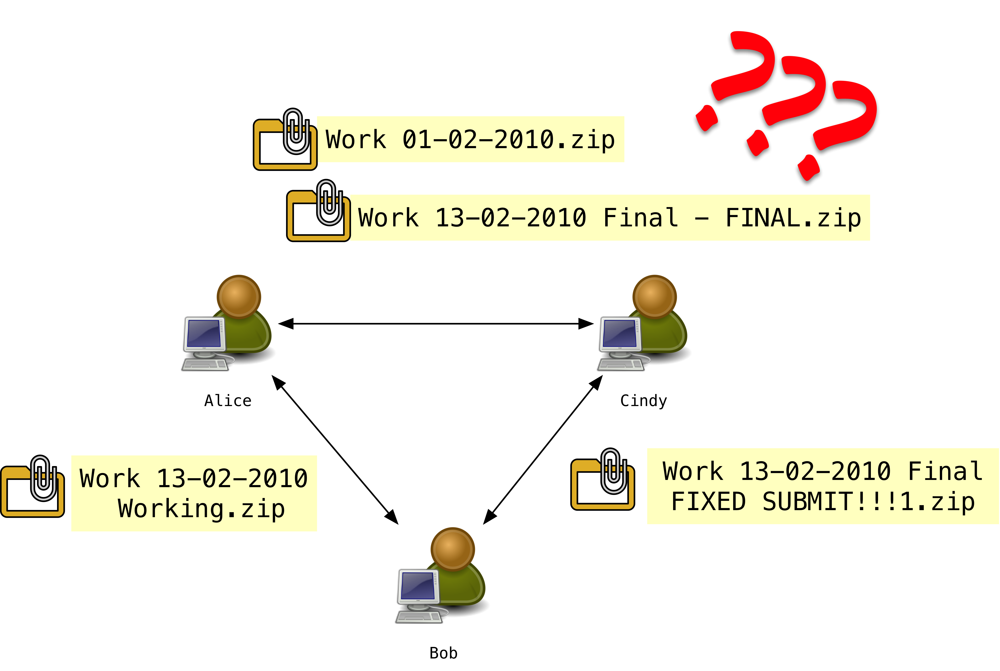
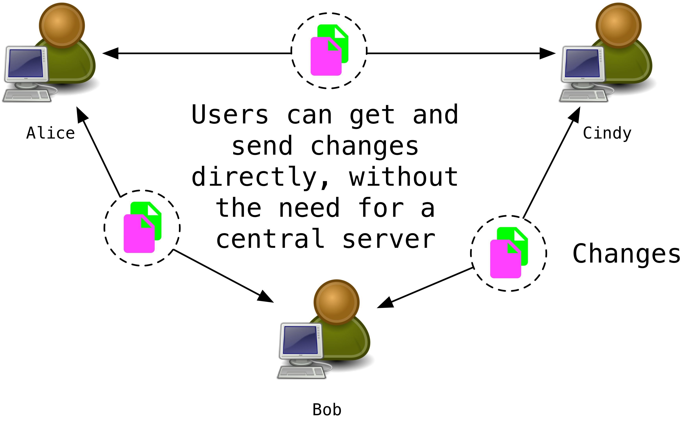



name: git
class: middle, center
template:inverse

# Git
[distributed version-control system]

## Introduction and Basics
by [João Rocha da Silva](https://silvae86.github.io), based on ['Version Control with Git, 2nd Edition'](https://www.oreilly.com/library/view/version-control-with/9781449345037/) by Jon Loeliger & Matthew McCullough.

---
name: agenda
class: middle, center

## Agenda
.index[

.indexpill[[About](#about)]

.indexpill[[None/Centralized/Distributed VCS](#none_vs_centralized_vs_distributed)]

.indexpill[[History](#history)]

.indexpill[[Concepts](#concepts)]

.indexpill[[Creating a repository from scratch](#creating_a_repository_from_scratch)]

.indexpill[[Cloning an existing repository](#cloning_an_existing_repository)]

.indexpill[[Adding files](#adding)]

.indexpill[[Checking status of the repository](#checking_status)]

.indexpill[[Committing changes](#committing)]

.indexpill[[Pushing your commits](#pushing)]

.indexpill[[Pulling commits](#pulling)]

.indexpill[[Branches](#branches)]

.indexpill[[Merging](#merging)]

.indexpill[[Conflicts](#conflicts)]

.indexpill[[Change log](#log)]

]

.index[

.indexpill[[GitHub](#github)]

.indexpill[[References](#references)]

]
---
name: about
## About

- A **distributed** source code **version control** system.

- **Version control** because it tracks all changes made to the code of a software solution

- **Distributed**, because it does not require a **repository server**
	- All collaborators of the repository can synchronize their code without the need for a "central authority"
- <u>Keeps your code safe, </u>

.footnote[.red[*]We will cover some basics of Git usage in these slides. More advanced usage can be explored in the bibliography]

---
name: none_vs_centralized_vs_distributed
## None/Centralized/Distributed VCS (1/3)

### No Version Control System

.center[.imgscaledup[]]

---

## None/Centralized/Distributed VCS (2/3)

### Centralized VCS

.center[.imgscaledup[]]

---

## None/Centralized/Distributed VCS (3/3)

### Distributed VCS

.center[.imgscaledup[]]

---
name: history
## History

| | Name                      | Acronym | Type          |
| ---- | ------------------------- | ------- | ------------- |
| 1986 | Concurrent Version System | CVS     | Centralized   |
| 2001 | Subversion                | SVN     | Centralized   |
| 2000 | BitKeeper                 | -       | Decentralized |
| 2005 | Mercurial                 | Hg      | Decentralized |
| 2005 | Git                       | -       | Decentralized |

---
name: concepts
## Concepts

- A **repository** is a folder with some files added by the VCS. 
	- In `Git`, the root of the folder will contain an *invisible* `.git`.red[*] folder with information that it uses to keep track of the changes made to everything in that folder, among other things.
- **Cloning** is to create a local copy of a repository present at some remote location
- **Changes** are calculated automatically by Git whenever a file inside a repository is edited. They refer to lines added, removed or modified in all the files in the repository, as well as files added, deleted or renamed.
- **Commits** are similar to milestones on a road: they are used to "mark" the current state of the repository as a milestone. When you commit your changes you are only modifying the local copy of the repository. Nothing will be sent 
- **Pulling** means to retrieve the latest changes present in the remote
- **Pushing** is to send all your local commits i.e. to send all changes made locally back to the remote
- **Branches** are like the branches on a tree. You can branch out your code to work separately on a certain functionality. When you think it is stable, you can **merge** it back into the main branch, which is like the trunk of a tree
- **Merging** is to merge all the changes made in a separate branch back into the main branch of the repository.

.footnote[.red[*] Unless you turn on "Show hidden files" in Windows]

---
name: creating_a_repository_from_scracth
## Creating a repository from scratch

---
name: cloning_an_existing_repository
## Cloning an existing repository

---
name: adding_files
## Adding files

---
name: checking_status
## Checking status

---
name: committing
## Committing changes

---
name: pushing
## Pushing your commits

---
name: pulling
## Pulling changes from remote

---
name: branches
## Branches

---
name: merging
## Merging 

---
name: conflicts
## Conflicts

---
name: log
## Change log

---
name: references
## References

- *Version Control with Git, 2nd Edition* 
	Loeliger, J., & McCullough, M. (2012).  
	O'Reilly Media, Inc..

- *Git Commands on GitHub, by joshnh* [Link](https://github.com/joshnh/Git-Commands)
	- An interesting *cheat sheet* for command-line (advanced) use of Git



