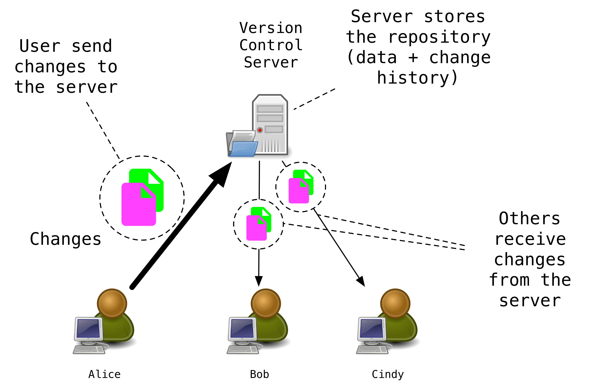



name: git
class: middle, center
template:inverse

# Git
[distributed version-control system]

## Introduction and Basics
by [João Rocha da Silva](https://silvae86.github.io), based on ['Version Control with Git, 2nd Edition'](https://www.oreilly.com/library/view/version-control-with/9781449345037/) by Jon Loeliger & Matthew McCullough.

---
name: agenda
class: middle, center

## Agenda
.index[

.indexpill[[About](#about)]

.indexpill[[None/Centralized/Distributed VCS](#none_vs_centralized_vs_distributed)]

.indexpill[[History](#history)]

.indexpill[[Concepts](#concepts)]

.indexpill[[Creating a repository](#creating)]

.indexpill[[Cloning a repository](#clone)]

.indexpill[[Adding files](#adding)]

.indexpill[[Checking status](#status)]

.indexpill[[Committing](#committing)]

.indexpill[[Pushing your commits](#pushing)]

.indexpill[[Pulling changes](#pulling)]

.indexpill[[Branches](#branches)]

.indexpill[[Merging](#merging)]

.indexpill[[Conflicts](#conflicts)]

.indexpill[[Tracking history](#log)]

]

.index[

.indexpill[[GitHub](#github)]

.indexpill[[References](#references)]

]
---
name: about
## About

- A **distributed** source code **version control** system.

- **Version control** because it tracks all changes made to the code of a software solution

- **Distributed**, because it does not require a **repository server**
	- All collaborators of the repository can synchronize their code without the need for a "central authority"
- <u>Keeps your code safe, </u>

.footnote[.red[*]We will cover some basics of Git usage in these slides. More advanced usage can be explored in the bibliography]

---
name: none_vs_centralized_vs_distributed
## None/Centralized/Distributed VCS (1/3)

### No Version Control System

.center[.imgscaledup[]]

---

## None/Centralized/Distributed VCS (2/3)

### Centralized VCS

.center[.imgscaledup[]]

---

## None/Centralized/Distributed VCS (3/3)

### Distributed VCS

.center[.imgscaledup[]]

---
name: history
## History

| | Name                      | Acronym | Type          |
| ---- | ------------------------- | ------- | ------------- |
| 1986 | Concurrent Version System | CVS     | Centralized   |
| 2001 | Subversion                | SVN     | Centralized   |
| 2000 | BitKeeper                 | -       | Decentralized |
| 2005 | Mercurial                 | Hg      | Decentralized |
| 2005 | Git                       | -       | Decentralized |

---
name: Concepts
## Concepts

- A **repository** is a folder with some files added by the VCS. 
	- For Git, the root of the folder will have a hidden `.git` folder with information that it uses to keep track of the changes made to everything in that folder, among other things.
- **Changes** are calculated automatically by Git whenever a file inside a repository is edited.
- **Commits** are like the milestones on a road: they are used to "save" the current state of the repository

---
name: references
## References

- *Version Control with Git, 2nd Edition* 
	Loeliger, J., & McCullough, M. (2012).  
	O'Reilly Media, Inc..

- *Git Commands on GitHub, by joshnh* [Link](https://github.com/joshnh/Git-Commands)
	- An interesting *cheat sheet* for command-line (advanced) use of Git



